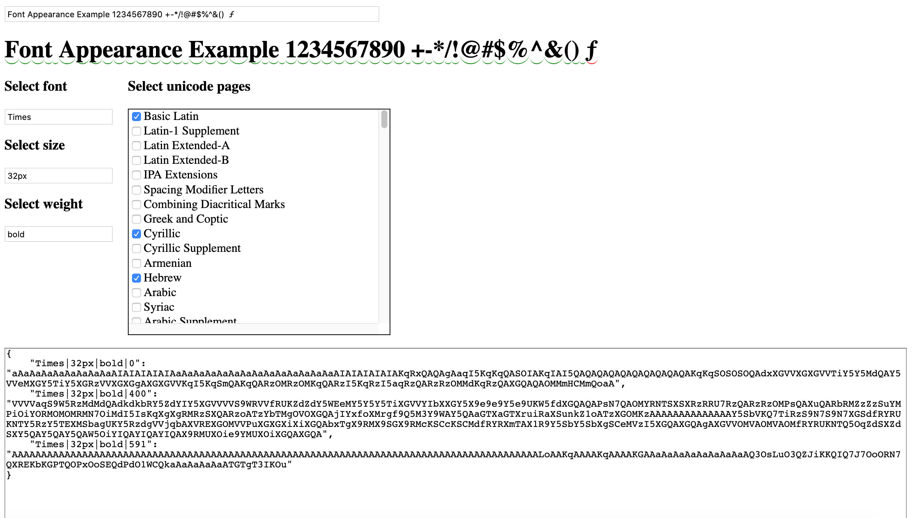

# js-server-text-width

This module provides function for calculating text width in pixels. In the browser you have that capability out of the box (with canvas or with hidden element) but not in node. It is useful for server side rendering when you need to trim text to some placeholder or to draw something around the text.

## Instalation

    npm install server-text-width

## Features

- no dependencies
- works in node and in browser same way
- supports unicode characters (not only latin or ASCII)
- supports many fonts (your own fonts as well)
- supports many font sizes
- supports font weight
- typescript definitions included
- minimizes size of table data

## How it works?

Original idea was borrowed from https://github.com/adambisek/string-pixel-width

1. Open special tool `mappingTool.html` included in that package
1. In that tool choose font name, size and weight. Also select range of unicode characters.
1. The tool generates you table with widths for each character.
1. Put a table into your source as constant and initialize module with it.
1. Now you have function that can measure text width.

## Step by step

Open `mappingTool.html` in you browser. You can download it from github https://raw.githubusercontent.com/Evgenus/js-server-text-width/main/mappingTool.html 



Select font you want to measure, font size, font weight and range of characters. All unicode pages are already here. You can select based on locale (or locales) you use. You can also experiment with text using input on top. All characters that are not covered with selected unicode ranges will be highlighted with red.

At the very bottom the tool will generate you table data, that you need to feed into module. Each character width is represented with 2 symbols in base 64 encoding. One for integer and one for fractional part (in font rendered characters have fractional width in pixels). That is much more compact than storing data in JSON.

In your code create a constant variable with that value.

```typescript
const TEXT_WIDTH_LOOKUP_TABLE = {
    "Times|32px|bold|0": "aAaAaAaAaAaAaAaAaAIAIAIAIAIAaAaAaAaAaAaAaAaAaAaAaAaAaAaAIAIAIAIAIAKqRxQAQAgAaqI5KqKqQASOIAKqIAI5QAQAQAQAQAQAQAQAQAQAKqKqSOSOSOQAdxXGVVXGXGVVTiY5Y5MdQAY5VVeMXGY5TiY5XGRzVVXGXGgAXGXGVVKqI5KqSmQAKqQARzOMRzOMKqQARzI5KqRzI5aqRzQARzRzOMMdKqRzQAXGQAQAOMMmHCMmQoaA",
    "Times|32px|bold|400": "VVVVaqS9W5RzMdMdQAdkdkbRY5ZdYIY5XGVVVVS9WRVVfRUKZdZdY5WEeMY5Y5Y5TiXGVVYIbXXGY5X9e9e9Y5e9UKW5fdXGQAQAPsN7QAOMYRNTSXSXRzRRU7RzQARzRzOMPsQAXuQARbRMZzZzSuYMPiOiYORMOMOMRMN7OiMdI5IsKqXgXgRMRzSXQARzoATzYbTMgOVOXGQAjIYxfoXMrgf9Q5M3Y9WAY5QAaGTXaGTXruiRaXSunkZ1oATzXGOMKzAAAAAAAAAAAAAAY5SbVKQ7TiRzS9N7S9N7XGSdfRYRUKNTY5RzY5TEXMSbagUKY5RzdgVVjqbAXVREXGOMVVPuXGXGXiXiXGQAbxTgX9RMX9SGX9RMcKSCcKSCMdfRYRXmTAX1R9Y5SbY5SbXgSCeMVzI5XGQAXGQAgAXGVVOMVAOMVAOMfRYRUKNTQ5OqZdSXZdSXY5QAY5QAY5QAW5OiYIQAYIQAYIQAX9RMUXOie9YMUXOiXGQAXGQA",
    "Times|32px|bold|591": "AAAAAAAAAAAAAAAAAAAAAAAAAAAAAAAAAAAAAAAAAAAAAAAAAAAAAAAAAAAAAAAAAAAAAAAAAAAAAAAAAAAAAAAAAALoAAKqAAAAKqAAAAKGAAaAaAaAaAaAaAaAaAQ3OsLuO3QZJiKKQIQ7J7OoORN7QXREKbKGPTQOPxOoSEQdPdO1WCQkaAaAaAaAaATGTgT3IKOu"
};
```

NOTE: If you need multiple fonts, sizes, weight or ranges just merge that dictionary manually. The tool is limited to produce only one set at the time for simplicity.

Then in code

```
import { init } from 'server-text-width';

const { getTextWidth } = init(TEXT_WIDTH_LOOKUP_TABLE);
export { getTextWidth };
```